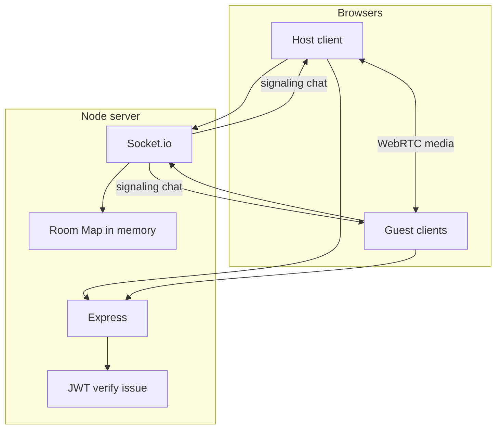
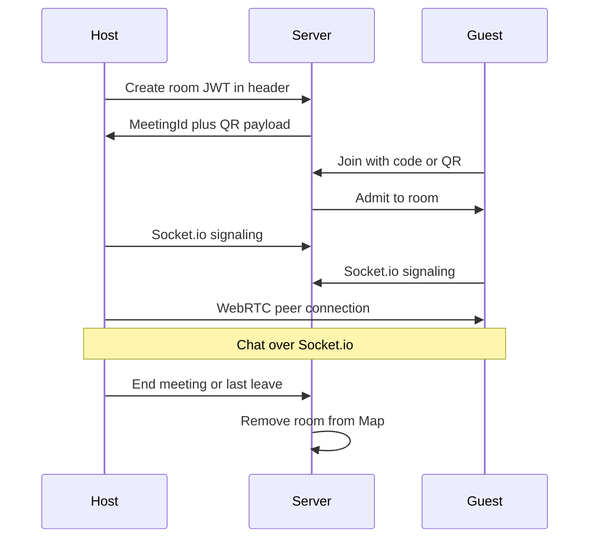

# Ez meeting — product scope

A web app similar to Zoom: a host creates a meeting; others join with a meeting code or QR code. Real-time text chat, voice, and video. Prefer **free / open-source** tooling for development.

---

## Authentication (no database)

**Decision:** Identity is **email + display name** only. **No Google OAuth** and **no user table**—this keeps the stack stateless on the server aside from in-memory meeting state.

- **First visit:** User enters **email** and **display name**. The server validates input, issues a **signed JWT** (claims: `email`, `name`, `iat`, `exp`), and returns it to the client. The client stores the token (e.g. `localStorage` or `sessionStorage`).
- **Return visit:** If a **valid, unexpired** JWT is present, the app can skip a full login screen and show host/join directly (or only ask for email if the token is missing or expired). “No login page” means **no OAuth provider screen** and **no password**—at most a minimal identity step when the token is absent or expired.
- **Token expiry:** Define a TTL (e.g. 7 days). After expiry, the user re-enters email + name to obtain a new JWT. No refresh token is required for the MVP if you accept re-entry.

This aligns with **no database**: the server only verifies JWT signatures (using `JWT_SECRET`) and does not persist accounts.

---

## Requirements

1. Users identify with **email and display name**, then **host or join** a meeting via **link** or **QR code** (no Gmail-only or third-party login for MVP).
2. When hosting, the system generates a **meeting ID** (e.g. random 6-character code) and a **QR code** encoding the join URL or code.
3. After closing the site, a **return visit** uses the stored JWT where possible; otherwise a **short email (+ name) step**—no separate OAuth login page.
4. **No persistent application data**: no database for users or chat history; meeting state lives in server memory (e.g. a `Map`) for the lifetime of the meeting.
5. **MVP limits (explicit):** target **small groups** (full-mesh WebRTC); **no** cloud recording, **no** persistent chat history after the meeting ends, **no** guaranteed mobile polish unless scoped later.

---

## Meeting lifecycle

| Phase | Behavior |
|--------|----------|
| **Created** | Host receives meeting ID + QR; room entry exists in the server `Map`. |
| **Active** | Participants connect via Socket.io (signaling + chat) and WebRTC (media). |
| **Ended** | When the **host ends the meeting** or the **last participant leaves**, remove the room from the `Map`, disconnect related sockets, and **invalidate** the meeting ID and QR (same as Zoom—codes are useless after teardown). |

QR codes do not need a separate “kill” mechanism: they encode the same ID/URL; once the room is removed, joins fail.

---

## Non-goals (MVP)

- User accounts, passwords, or OAuth providers (Google, etc.).
- Storing messages, recordings, or attendance in a database.
- Large conferences: mesh WebRTC scales to small **n**; an SFU (e.g. mediasoup, LiveKit) is out of scope unless you expand later.

---

## Architecture (in-repo diagrams)

Overall structure:

Live session flow:

Optional raster diagrams: if you add `diagrams/full_archi.jpg` and `diagrams/flow.jpg`, keep them aligned with the flows above. See [diagrams/README.md](diagrams/README.md).

---

## Build order

1. Set up **Express** + **Socket.io**; test chat between two browser tabs.
2. Add **JWT** login with **email** (and name); no database.
3. Add **room creation** (e.g. random 6-character code) stored in a **Map**.
4. Add **WebRTC** with **simple-peer** for **two-person** video/voice.
5. Add **QR generation** and scanning for the join URL or code.
6. **Scale to multi-user** by connecting peers in a mesh (loop / pair-wise connections); accept CPU/bandwidth limits for small **n**.

After the meeting finishes, the **meeting ID and QR** are **removed** with the room, like Zoom.
